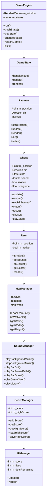

# UML 类图

```mermaid
classDiagram
    class GameEngine {
        -RenderWindow m_window
        -vector m_states
        +run()
        +pushState()
        +popState()
        +changeState()
        +restartGame()
        +quit()
    }
    class GameState {
        +handleInput()
        +update()
        +render()
    }
    class Pacman {
        -Point m_position
        -Direction dir
        -int lives
        +setDirection()
        +update()
        +render()
        +die()
        +reset()
    }
    class Ghost {
        -Point m_position
        -Direction dir
        -State state
        -double speed
        -bool isAlive
        -float scarytime
        +update()
        +render()
        +setFrightened()
        +eaten()
        +reset()
        +chase()
        +getColor()
    }
    class Item {
        -Point m_position
        -bool m_active
        +isActive()
        +getBounds()
        +onCollect()
        +getScore()
        +render()
    }
    class MapManager {
        -int width
        -int height
        -map world
        +LoadFromFile()
        +isWalkable()
        +getWord()
        +getWidth()
        +getHeight()
    }
    class SoundManager {
        +playBackgroundMusic()
        +stopBackgroundMusic()
        +playEatDot()
        +playEatPowerPellet()
        +playEatGhost()
        +playGameOver()
        +playVictory()
    }
    class ScoreManager {
        -int m_score
        -int m_highScore
        +addScore()
        +getScore()
        +getHighScore()
        +loadHighScore()
        +saveHighScore()
    }
    class UIManager {
        -int m_score
        -int m_lives
        -int m_dotsRemaining
        +update()
        +render()
    }
    GameEngine ..> GameState
    GameState ..> Pacman
    Pacman ..> Ghost
    Ghost ..> Item
    Item ..> MapManager
    MapManager ..> SoundManager
    SoundManager ..> ScoreManager
    ScoreManager ..> UIManager
```