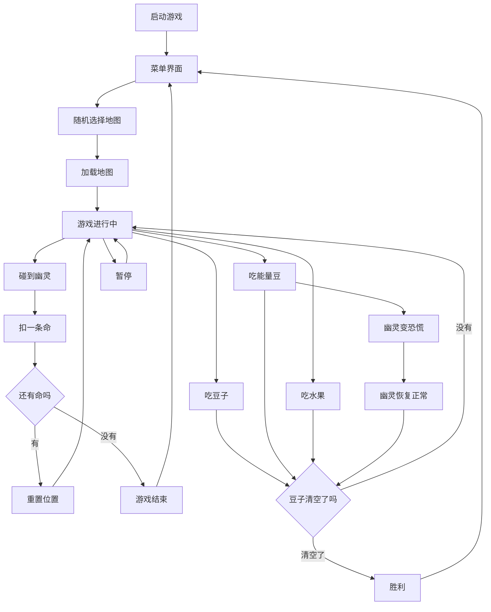

# 系统整体结构图

```mermaid
graph TB
    A[启动游戏] --> B[菜单界面]
    B --> C[随机选择地图]
    C --> D[加载地图]
    D --> E[游戏进行中]
    E --> F[吃豆子]
    E --> G[吃能量豆]
    E --> H[吃水果]
    E --> I[碰到幽灵]
    G --> J[幽灵变恐慌]
    J --> K[幽灵恢复正常]
    I --> L[扣一条命]
    L --> M{还有命吗}
    M -->|有| N[重置位置]
    N --> E
    M -->|没有| O[游戏结束]
    F --> P{豆子清空了吗}
    G --> P
    H --> P
    K --> P
    P -->|没有| E
    P -->|清空了| Q[胜利]
    E --> R[暂停]
    R --> E
    O --> B
    Q --> B
```
